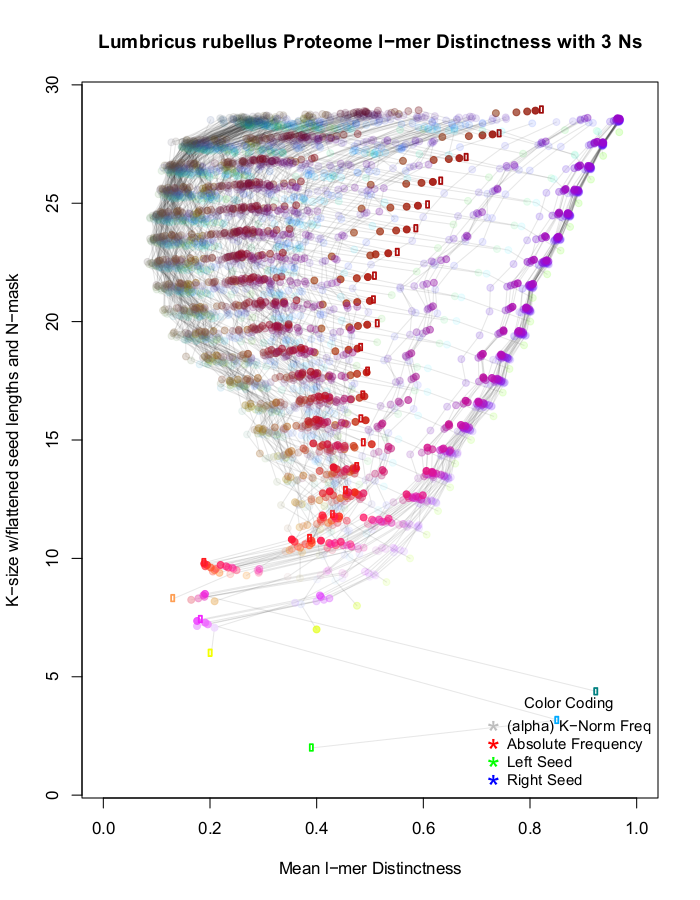

# High Dimensional Signatures Generation for Proteomes
Intersects long-lmer protein sequence space with flexibility masks to generate biologically informative high dimensional signatures

This is a high dimensional space exploration program. Consequently it is very RAM hungry. For example, make ~500GB of RAM available for an N=3 exploration of a 30MB proteome.

<Link to Publication to be added once submitted>
  

Usage Message:
```
UGPep: Protein Structural Complexity Assessment Tool

Required Input:
-g			The fasta formatted genome file
-o			The output file prefix, includes pathway

Optional Inputs:
-p			The genomic ploidy of the organism <int> [2]
-x			Paired read-depth file
-d			Max tree depth/k-mer length <int> [25]
-t			Max threads to run (2*cpus reccommended) <int>[4]
-n			Number of Ns in kmers <int>[2]
-s			Flag, prevents escaped frequency subtraction
-u			Flag, prevents null tree generation
-h			Prints this screen

Typical Usage:

./UGPep -g my_proteome.pep -d 28 -o ~/file/path/to/my_kd_out
```

Output Files:
```
<prefix>_main_prior.txt         3D Signature before local null subtraction
<prefix>_main_sub.txt           3D Signature post-subtraction
<prefix>_main_SD.txt            3D Signature no-subtraction, with deviations per point
<prefix>_null.txt               3D Local Null Signature
  
<prefix>_short_main_prior.txt   2D Signature before local null subtraction
<prefix>_short_main_sub.txt     2D Signature post-subtraction
<prefix>_short_main_null.txt    2D Local Null Signaute
```

## Visualisation

<Explain R Code here>


## Example Signatures




## Interpreting Signatures


